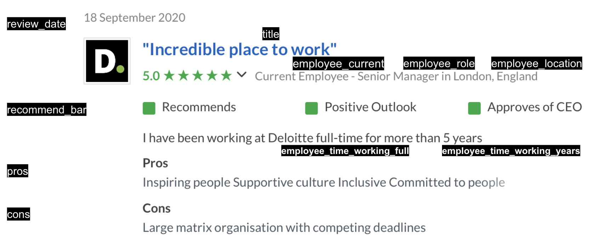

# Scraper fro glassdoor.com

The main code fro scraping is in glassdoor_scraper/spiders/glassdoor.py.
- Logs into glassdoor at init of the scraper: 
to use you must create a `glassdoor_scraper/secrets.json` file with glassdoor account password and username:
```json
{"glassdoor_pw": "your Glassdoor PW",
"glassdoor_user": "you Glassdoor user name / mail"}
```

- follows result pages starting from the London result page 

- goes to each company page extracts additional company info:

- follows `reviews_url` and extracts all reviews by following pagination of the review pages
- Example review with fields extracted:


All fields (company and review data) are defined in glassdoor_scraper/items.py.

The filenames for company info and reviews are set in JsonWriterPipeline in pipelines.py.   
(referred to in settings.py ITEM_PIPELINES).

# Chromedriver

Since some of the content is dynamic we need Selenium (with Chromedriver) to load the 
 full page content.  Chromedriver needs to be downloaded 
 and placed into `glassdoor_scraper/spiders/chromedriver`.
 
 # Run the scraper
To run the scraper create the /data directory in the root of the repo  and run: 

```bash
mkdir data
scrapy crawl glassdoor_scraper/spiders/glassdoor
```
The review and company data is saved to 
json lines files (CompanyInfo.jl, Reviews.jl) 
in the /data subdirectory of the root folder.
